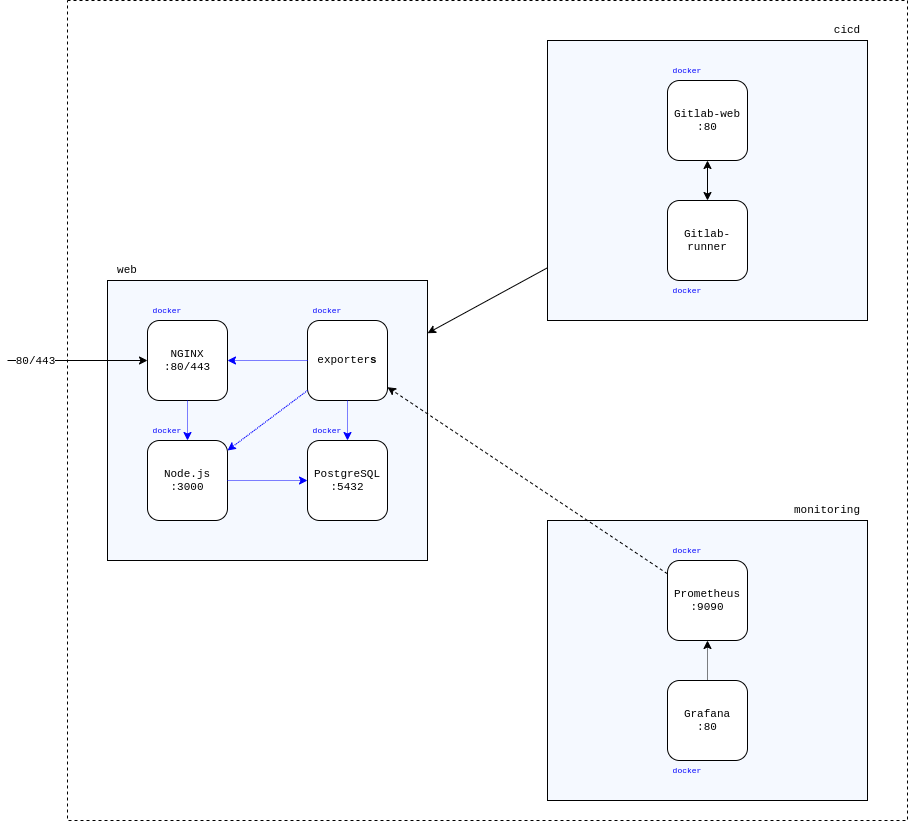

# Выпускной проект курса DevOps образовательной платформы OTUS

## Тема: Разворачивание инфраструктуры базы знаний Wiki.js и создание процесса непрерывной интеграции приложения с использованием практик и инструментов DevOps

Имеем следующую схему проекта.

Конфигурация проекта:
- 3 виртуальные машины GCP: web, cicd, monitoring. Для каждой виртуальной машины выделено свой внешний IP адрес.
- На каждой виртуальной машине установлен Docker.
- На сервере web установлены контейнеры NGINX, Node.js, MongoDB и exporter
- На сервере cicd установлен GitlabCI.
- На сервере monitoring установлен Prometheus  для сбора статистики и Grafana для визуализации графиков.

---

## Процесс

1. [x] Разворачивание инфраструктуры виртуальных машин с использованием Terraform
2. [x] Установка Docker и необходимого ПО, разворачиванием первичной инфраструктуры контейнеров с помощью Ansible и docker-compose файлов.
3. [x] Настройка Gitlab CI/CD
4. [ ] Настройка pipeline проекта. Настройка test / stage / prod сред.
5. [ ] Развертывание системы мониторинга Prometheus
6. [ ] Развертывание и настройка визуализации метрики в Grafana
7. [ ] Проверка целостности системы

---

Подготовка.
1. Учётная запись Google Cloud Platform.
2. Сервисный аккаунт Google. .json файл для работы с Ansible необходимо разместить в директори `ansible`.

Используемые версии используемых инструментов проекта:
1. Terraform 0.12.18
2. Ansible 2.9.4
3. Docker на виртуальный машинах 19.03.4, docker-compose 3

---

## Terraform

Для разворачивания инфраструктуры будем использовать Terraform. Для разворачивания инфраструктуры виртуальных машин конфигурации проекта в корне проекта переходим в директорию `terraform` и выполним команду `terraform apply`. Подтверждаем создание инфраструктуры и дожидаемся завершения.

## Ansible

После разворачивания инфраструктуры выполняем разворачивание контейнеров. Переходим в `ansible`, выполняем команду `ansible-playbook playbook/common.yml`.

## CI/CD

## Prometheus + Grafana

## Источники:
1. [Managing MongoDB on docker with docker-compose](https://medium.com/faun/managing-mongodb-on-docker-with-docker-compose-26bf8a0bbae3)
2. [Secured MongoDB container](https://medium.com/@MaxouMask/secured-mongodb-container-6b602ef67885)